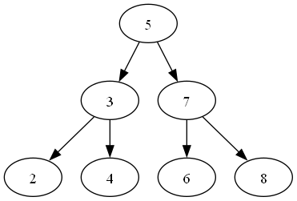

# Бинарное дерево поиска:
```java
class Node {
    int value;
    Node left;
    Node right;

    public Node(int value) {
        this.value = value;
        this.left = null;
        this.right = null;
    }
}

public class BinaryTreeSearch {
    Node root;

    public BinaryTreeSearch() {
        this.root = null;
    }

    public void addElements(int[] values) {
        for (int value : values) {
            addElement(value);
        }
    }

    public void addElement(int value) {
        Node newNode = new Node(value);

        if (root == null) {
            root = newNode;
            return;
        }

        Node currentNode = root;
        while (true) {
            if (value < currentNode.value) {
                if (currentNode.left == null) {
                    currentNode.left = newNode;
                    break;
                }
                else {
                    currentNode = currentNode.left;
                }
            }

            if (value > currentNode.value) {
                if (currentNode.right == null) {
                    currentNode.right = newNode;
                    break;
                }
                else {
                    currentNode = currentNode.right;
                }
            }
        }
    }

    public boolean search(int value) {
        Node currentNode = root;

        while (currentNode != null) {
            if (value == currentNode.value) {
                return true;
            } else if (value < currentNode.value) {
                currentNode = currentNode.left;
            } else {
                currentNode = currentNode.right;
            }
        }

        return false;
    }
}

class Main {
    public static void main(String[] args) {

        BinaryTreeSearch binaryTree = new BinaryTreeSearch();
        int[] values = {5, 3, 7, 2, 4, 6, 8};

        binaryTree.addElements(values);
        System.out.println("Попробуем найти элемент 2: " + binaryTree.search(2)); // true
        System.out.println("Попробуем найти элемент 17: " + binaryTree.search(17)); // false
    }
}
```
## Дерево будет выглядеть следующим образом:



