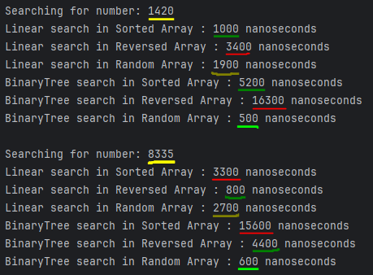

# Подведение итогов:

В ходе изучения были рассмотрены несколько алгоритмов:
линейный поиск, бинарный поиск, поиск в бинарном дереве и экспоненциальный поиск.

## Алгоритмы для *неупорядоченных* массивов:
1. **Линейный поиск:**
    - Последовательно проверяет каждый элемент массива на равенство с элементом, который ищем.
    - Может быть эффективен в небольших неупорядоченных массивах.
    - *Минусы:* Взависимости от выбора начала поиска (с начала массива или его конца), если элемент находится в противоположной части - временная сложность близится к худшей.
    - Временная сложность в худшем случае O(n), где n - размер массива. 

2. **Поиск в бинарном дереве:**
    - Поиск в дереве, где каждый узел имеет не более двух потомков
    - Позволяет быстро находить элементы в хорошо-структурированном дереве.
    - *Минусы:* Худший случай может возникнуть при добавлении в пустое дерево уже отсортированного массива, тогда узлы будут добавлять потомков либо только с правой, либо же с левой стороны, что является неэффективным.
    - Временная сложность в худшем случае O(n), где n - высота дерева.

#### Поиск бинарного дерева отлично показал себя в неупорядоченном массиве. В упорядоченных массивах эффективность аналогична линейному поиску.

## Алгоритмы для *упорядоченных* массивов:
#### Сразу должен отметить, что сортировка должна быть исключительно в порядке возрастания, иначе алгоритм вернет "-1", то есть не найдет необходимый элемент.

1. **Бинарный поиск:**
    - Эффективный алгоритм для поиска элемента в отсортированных массивах.
    - Основан на методе деления пополам, что позволяет быстро сокращать область поиска.
    - Временная сложность O(log n) в худшем случае, где n - размер массива.
    - *Минусы:* Невозможен для неупорядоченных или обратно-отсортированных массивов.

2. **Экспоненциальный поиск:**
    - Модификация бинарного поиска.
    - Увеличивает шаг деления пополам экспоненциально до тех пор, пока не будет найден интервал, в который входит искомый элемент.
    - *Минусы:* Невозможен для неупорядоченных или обратно-отсортированных массивов.
    - Временная сложность O(log n), где n - размер массива.

#### Мои замеры показали примерно одинаковый результат в массиве на 10000 элементов.
#### Однако же в мега-огромных массивах бинарный поиск предпочтительнее, в то время как экспоненциальный наиболее эффективен для поиска элемента, близкого к началу массива.

#### Каждый из этих методов может быть использован для поиска элемента в подходящем ему массиве.